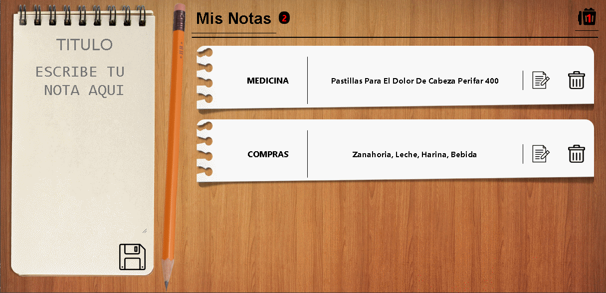

## Mis Notas

An application used to take notes, built with React, JavaScript, HTML and CSS.

#### The Project:

This project was developep as part of the bootcamp of Moove it. Users can write a note and saved in the localStorage, edited, deleted and keep it in the recycled bin, edit and restored from the recycled bin.

## Installation and Setup Instructions

Clone down this repository. You will need `node` and `npm` installed globally on your machine.  

Installation:

`npm install`  

To Start Server:

`npm start`  

To Visit App:

`localhost:3000`  

#### My Experience:  

I started creating the structure of the app with create-react-app, then use inputs for capture the data that the user will enter, created the structure of the notes, fuctions to delete and edit, the biggest challenge the i have was the localStorage, then i developed a vintage look for the app, take one week of part time work.

